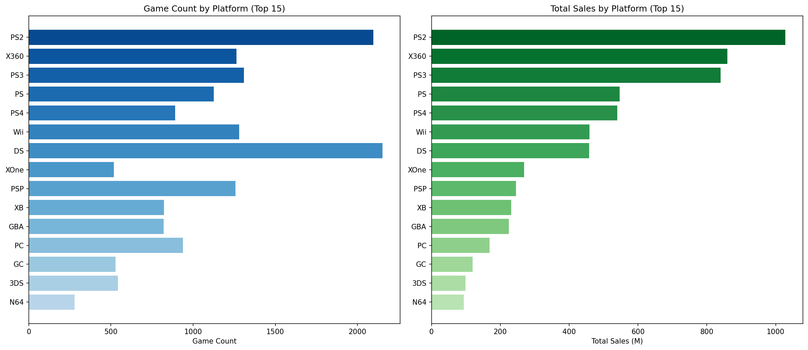
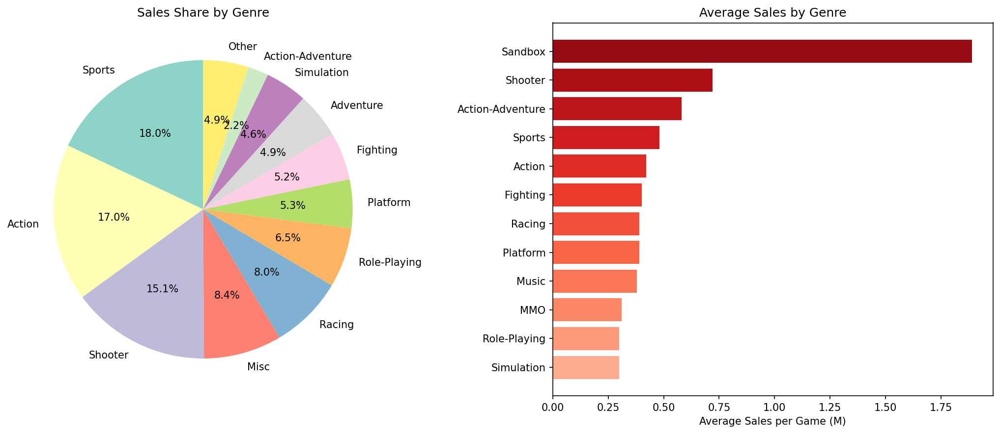
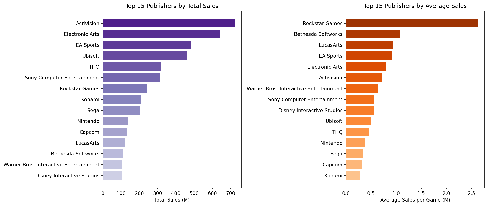
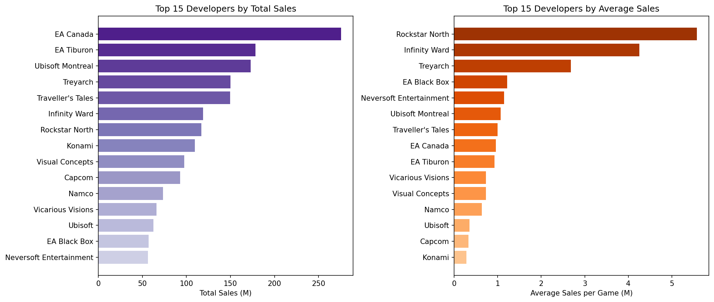
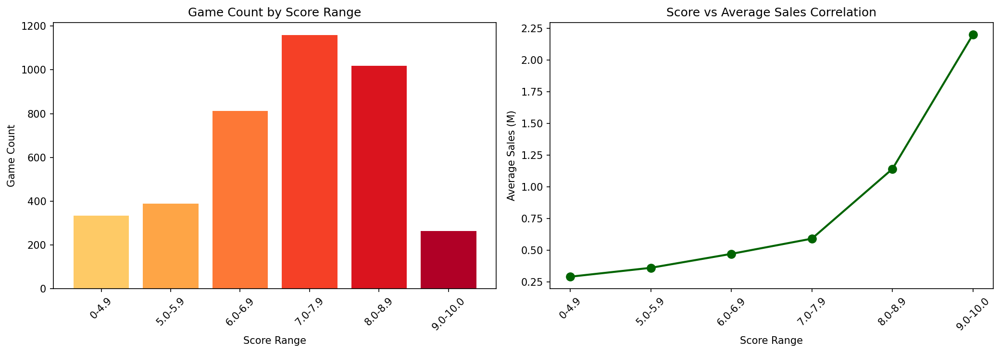
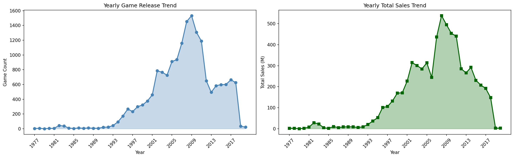
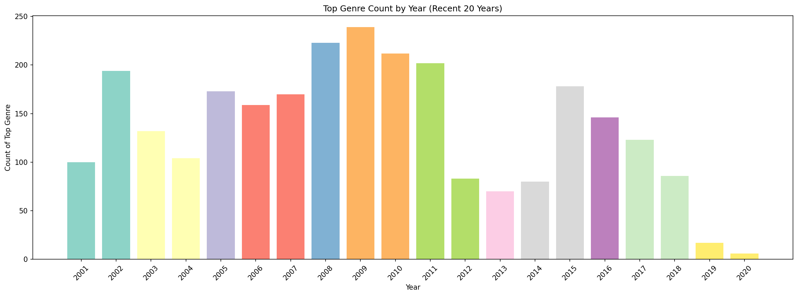
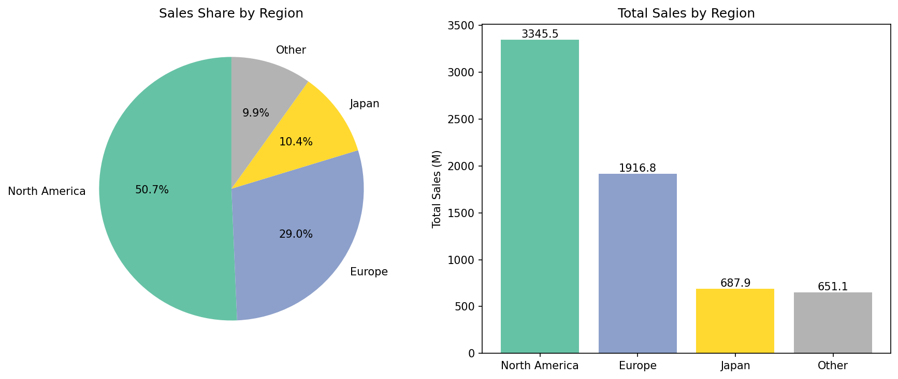
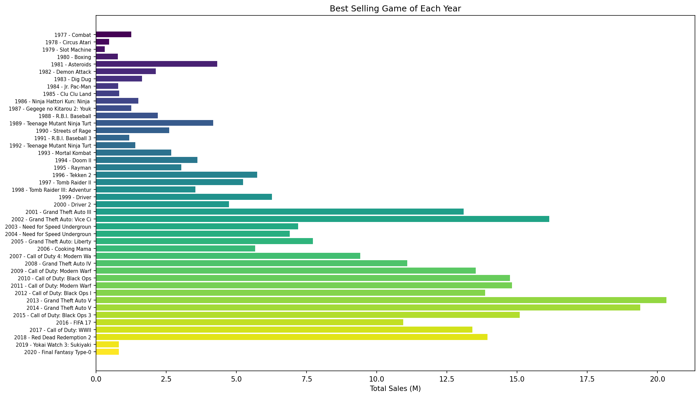

# 大数据处理与分析课程设计报告

**项目名称：** 基于Apache Flink的电子游戏销售数据分析系统  
**学号：** ________  
**姓名：** ________  
**专业班级：** ________  
**指导教师：** ________  
**完成日期：** 2026年6月2日  

---

## 摘要

本课程设计基于Apache Flink大数据处理框架，结合HDFS分布式存储，对vgchartz-2024数据集（包含64,016条游戏销售记录）进行多维度分析。项目采用双模式架构——本地模式用于IDE调试，集群模式通过`flink run`提交到Flink Standalone集群，数据读写基于HDFS。通过Java编程实现9个核心分析任务，包括平台统计、游戏类型分析、出版商/开发商排名、评分与销量相关性分析、年度趋势分析、地区市场分析等。项目实践了"CSV→HDFS→Flink批处理→HDFS输出→Python可视化"的完整大数据处理链路，并编写Shell脚本实现一键自动化运行。分析结果表明，北美市场占全球游戏销售额的50.7%，评分与销量呈显著正相关（9.0+评分的平均销售额是低评分区间的7.6倍），Sports、Action、Shooter为三大主流游戏类型。

**关键词：** Apache Flink；HDFS；大数据分析；电子游戏销售；集群部署；数据可视化

---

## 目录

1. 项目背景与意义
2. 需求分析
3. 系统设计
   - 3.1 技术架构
   - 3.2 技术选型
   - 3.3 数据流设计
4. 数据说明
   - 4.1 数据集来源
   - 4.2 数据字段说明
   - 4.3 数据预处理
5. 算法与实现
   - 5.1 Flink分析任务设计
   - 5.2 核心算法流程
   - 5.3 关键代码说明
6. 实验结果与分析
   - 6.1 平台统计分析
   - 6.2 游戏类型分析
   - 6.3 出版商Top15分析
   - 6.4 开发商Top15分析
   - 6.5 评分与销量相关性分析
   - 6.6 年度趋势分析
   - 6.7 年度主流类型分析
   - 6.8 地区销售额分析
   - 6.9 年度最佳游戏分析
7. 结论与展望
   - 7.1 主要结论
   - 7.2 技术体会
   - 7.3 改进方向
8. 参考文献
9. 附录
   - 附录A：项目文件结构
   - 附录B：运行说明
   - 附录C：图表索引

---

## 1. 项目背景与意义

### 1.1 背景

电子游戏产业已成为全球娱乐产业中增长最快的领域之一，市场规模超过2000亿美元。随着游戏产业的蓬勃发展，产生了海量的销售数据、用户评分数据和平台分布数据，为大数据分析提供了丰富的基础。

传统的数据分析方法在处理数万条级别的数据时存在效率瓶颈，而Apache Flink作为新一代分布式流处理框架，具备卓越的批处理能力，能够高效处理大规模结构化数据集。

### 1.2 意义

本项目旨在通过实际案例验证Flink在大数据处理方面的优势，同时挖掘电子游戏市场的内在规律。具体意义包括：

1. **技术验证**：验证Apache Flink在处理大规模结构化CSV数据时的实际性能
2. **业务洞察**：通过多维度分析揭示游戏市场的产品分布、消费习惯和地区差异
3. **流程实践**：掌握"数据清洗→大数据处理→可视化呈现"的完整数据分析流程
4. **教学示范**：为大数据处理与分析课程提供完整的实践案例

---

## 2. 需求分析

本课程设计需要完成以下9个核心分析任务：

1. **平台统计**：分析各游戏平台的游戏数量、总销售额和平均销售额
2. **游戏类型分析**：统计各类型的游戏数量、总销售额和平均销售额
3. **出版商Top15**：找出发布游戏数量最多的15家出版商
4. **开发商Top15**：找出开发游戏数量最多的15家开发商
5. **评分与销量相关性**：分析Critic评分与游戏销量的关系
6. **年度趋势分析**：统计每年发布的游戏数量和总销售额
7. **年度主流类型**：找出每年发布数量最多的游戏类型
8. **地区销售额分析**：对比北美、日本、欧洲等地区的销售额分布
9. **年度最佳游戏**：找出每年销售额最高的游戏

---

## 3. 系统设计

### 3.1 技术架构

本项目采用 HDFS + Flink + Python 三层架构，支持本地调试与集群部署双模式运行：

```
┌──────────────────────────────────────────────────────────────────────┐
│                         集群模式 (HDFS + Flink)                        │
│  ┌──────────────┐    ┌──────────────┐    ┌──────────────┐            │
│  │   数据层      │    │   处理层      │    │   展示层      │            │
│  │   HDFS       │───▶│  Flink集群   │───▶│   Python     │            │
│  │   NameNode   │    │  JobManager  │    │   Matplotlib │            │
│  │   DataNode   │    │  TaskManager │    │   9张图表     │            │
│  └──────────────┘    └──────────────┘    └──────────────┘            │
│        ↕                    ↕                                         │
│   hdfs:// 读写        flink run 提交                                  │
│   Web UI: 9870       Web UI: 8081                                    │
└──────────────────────────────────────────────────────────────────────┘
                              ↕
┌──────────────────────────────────────────────────────────────────────┐
│                     本地模式 (直接IDE/Maven运行)                       │
│   CSV文件 ──▶ mvn exec:java ──▶ 本地output/ ──▶ Python可视化          │
└──────────────────────────────────────────────────────────────────────┘
```

### 3.2 技术选型

| 组件 | 技术/版本 | 说明 |
|------|-----------|------|
| 数据处理框架 | Apache Flink 1.17.1 | 分布式批流一体引擎，Standalone集群部署 |
| 分布式存储 | Apache Hadoop HDFS 3.2.2 | 分布式文件系统，数据读写与结果存储 |
| 编程语言 | Java 8 | Flink原生支持，开发企业级应用 |
| 构建工具 | Maven 3.6+ + maven-shade-plugin | 依赖管理，打包fat jar用于集群提交 |
| 数据可视化 | Python 3.8 + Matplotlib | 生成柱状图、饼图、折线图等 |
| 自动化脚本 | Bash Shell | 一键启动HDFS/Flink/提交Job/下载结果/可视化 |
| 开发环境 | IntelliJ IDEA | Java集成开发环境 |
| 部署环境 | CentOS 7 虚拟机 (node3) | Flink + HDFS伪分布式集群 |

### 3.3 数据流设计

**本地模式数据流**（开发调试）：
1. 本地CSV文件 → Flink DataStream API处理 → 本地output/目录

**集群模式数据流**（生产运行）：
1. HDFS存储输入CSV文件 → Flink集群读取处理 → 结果直接写回HDFS
2. 从HDFS下载结果到本地 → Python读取并生成可视化图表

两种模式共享相同的9个分析核心逻辑，仅在输入输出路径和运行方式上有差异。

### 3.4 系统模块设计

- **数据读取模块**：支持本地文件系统和HDFS双源读取，CSV解析为GameRecord对象
- **分析任务模块**：9个独立的分析任务，封装为可复用方法，本地版和集群版共享
- **结果输出模块**：本地模式写入文件系统，集群模式通过`writeAsText`直接写HDFS
- **可视化模块**：Python读取文本结果，生成9张Matplotlib图表
- **自动化脚本模块**：Shell脚本实现一键启动HDFS/Flink、提交Job、下载结果、生成图表的完整流程
- **双模式设计**：`VideoGameSalesFlinkAnalysisLocal`（本地调试）与`VideoGameSalesFlinkAnalysisHDFS`（集群部署）独立入口类

---

## 4. 数据说明

### 4.1 数据集来源

数据集来源于vgchartz.com的游戏销售数据，包含从1977年至2024年发布的64,016款电子游戏的销售信息和Critic评分。数据涵盖了主机游戏、PC游戏等多个平台。

### 4.2 数据字段说明

| 字段名 | 类型 | 说明 |
|--------|------|------|
| title | String | 游戏名称 |
| console | String | 发布平台（PS4, X360, NS等） |
| genre | String | 游戏类型（Action, Sports, Shooter等） |
| publisher | String | 发行商 |
| developer | String | 开发商 |
| critic_score | Double | Critic评分（0-10，0表示无评分） |
| total_sales | Double | 全球总销量（百万份） |
| na_sales | Double | 北美销量（百万份） |
| jp_sales | Double | 日本销量（百万份） |
| pal_sales | Double | PAL地区（欧洲/大洋洲）销量（百万份） |
| other_sales | Double | 其他地区销量（百万份） |
| release_date | String | 发布日期（YYYY-MM-DD格式） |

### 4.3 数据预处理

为保证数据质量，在Flink代码中进行了以下预处理操作：

1. **表头过滤**：使用`filter(line -> !line.startsWith("Rank"))`过滤CSV表头行
2. **手写CSV解析器**：处理字段内含双引号和逗号的情况（如游戏名中的逗号），通过`inQuotes`状态标志位正确分割字段
3. **缺失值处理**：critic_score缺失值默认为0，销售额缺失值默认为0
4. **数据转换**：从release_date字段提取前4位年份信息，用于时间序列分析
5. **数据过滤**：过滤`totalSales <= 0`的无效记录，以及解析失败(null)的记录
6. **年份提取**：`releaseYear = rd.substring(0, 4)`，仅保留发布年份

所有预处理均在Flink DataStream算子链中完成，无需外部脚本。

---

## 5. 算法与实现

### 5.1 Flink分析任务设计

本项目共实现9个核心分析任务，每个任务对应一个独立的Flink数据流处理流程：

1. **任务1**：平台统计（Console Statistics）
2. **任务2**：游戏类型分析（Genre Statistics）
3. **任务3**：出版商Top15（Publisher Top 15）
4. **任务4**：开发商Top15（Developer Top 15）
5. **任务5**：评分与销量相关性（Score-Sales Correlation）
6. **任务6**：年度趋势分析（Yearly Trend）
7. **任务7**：年度主流类型（Yearly Top Genre）
8. **任务8**：地区销售额分析（Region Sales）
9. **任务9**：年度最佳游戏（Yearly Best Game）

### 5.2 核心算法流程

所有分析任务均采用Flink DataStream API的批处理模式，核心算法流程如下：

1. **数据读取**：`env.readTextFile()` 从本地文件或HDFS读取CSV
2. **数据解析**：使用`filter`+`map`算子将CSV行解析为GameRecord对象
3. **数据过滤**：使用`filter`算子过滤无效数据（空值、零销售额）
4. **字段提取**：使用`map`算子提取关键字段，转换为`Tuple`格式
5. **分组聚合**：使用`keyBy`算子按指定字段分组，`reduce`算子进行增量聚合计算
6. **排序处理**：使用`keyBy(1)`全局分区 + `TumblingProcessingTimeWindows`窗口 + 自定义`ProcessWindowFunction`进行排序和TopN筛选
7. **格式输出**：使用`map`算子格式化为竖线分隔文本
8. **结果写入**：使用`writeAsText()`写入，路径scheme自动决定输出到本地还是HDFS
9. **触发执行**：Flink懒执行机制，`env.execute()`才真正提交DAG到JobManager执行

### 5.3 关键代码说明

#### 5.3.1 双模式入口设计

项目提供两个独立的main入口类，共享相同的分析逻辑：

```java
// 本地模式 — 用于IDE调试和快速验证
public class VideoGameSalesFlinkAnalysisLocal {
    public static void main(String[] args) throws Exception {
        String inputPath = "data/vgchartz-2024.csv";
        String outputPrefix = "output/flink_";
        // ... 本地文件系统读写
        env.execute("Video Game Sales Flink Analysis - Local Mode");
    }
}

// 集群模式 — 用于HDFS + Flink集群部署
public class VideoGameSalesFlinkAnalysisHDFS {
    public static void main(String[] args) throws Exception {
        String inputPath = "hdfs://node3:9000/user/mushuting/input/vgchartz-2024.csv";
        String outputPrefix = "hdfs://node3:9000/user/mushuting/output/flink_";
        // 通过 flink run 提交，参数可从命令行覆盖
        env.execute("VGSales Flink Analysis - HDFS Mode");
    }
}
```

#### 5.3.2 数据解析代码（两种模式共享）

```java
// CSV行解析为GameRecord对象，手写解析器处理字段内逗号问题
DataStream<GameRecord> vgsales = text
    .filter(line -> !line.startsWith("Rank")) // 过滤表头
    .map(new MapFunction<String, GameRecord>() {
        @Override
        public GameRecord map(String line) throws Exception {
            return parseLine(line);
        }
    })
    .filter(record -> record != null && record.totalSales > 0);
```

#### 5.3.3 分组聚合示例（任务1：平台统计）

```java
DataStream<Tuple3<String, Long, Float>> platformSum = vgsales
    .map(new MapFunction<GameRecord, Tuple3<String, Long, Float>>() {
        @Override
        public Tuple3<String, Long, Float> map(GameRecord value) {
            return new Tuple3<>(value.console, 1L, (float) value.totalSales);
        }
    })
    .keyBy(0)  // 按平台分组
    .reduce(new ReduceFunction<Tuple3<String, Long, Float>>() {
        @Override
        public Tuple3<String, Long, Float> reduce(Tuple3<String, Long, Float> v1,
                Tuple3<String, Long, Float> v2) {
            return new Tuple3<>(v1.f0, v1.f1 + v2.f1, v1.f2 + v2.f2);
        }
    });
```

#### 5.3.4 自定义窗口排序与TopN函数

```java
// SortProcessFunction: 窗口内按销售额降序排序
public static class SortProcessFunction extends 
    ProcessWindowFunction<Tuple3<...>, ...> {
    @Override
    public void process(Integer key, Context context, 
            Iterable<Tuple3<...>> elements, Collector<Tuple3<...>> out) {
        List<Tuple3<...>> list = new ArrayList<>();
        for (Tuple3<...> e : elements) list.add(e);
        list.sort((a, b) -> Float.compare(b.f2, a.f2)); // 降序
        for (Tuple3<...> e : list) out.collect(e);
    }
}

// TopNProcessFunction: 窗口内排序后只输出前N条
public static class TopNProcessFunction extends ... {
    private final int n;
    // ... sort + for i < Math.min(n, list.size()) out.collect
}
```

#### 5.3.5 集群模式特有：maven-shade-plugin打包

```xml
<!-- pom.xml: 将项目+所有依赖打包成fat jar，提交到Flink集群 -->
<plugin>
    <groupId>org.apache.maven.plugins</groupId>
    <artifactId>maven-shade-plugin</artifactId>
    <version>3.4.1</version>
    <configuration>
        <finalName>vgsales-flink-1.0-all</finalName>
    </configuration>
</plugin>
```

#### 5.3.6 集群提交命令

```bash
# flink run 向JobManager提交任务
./bin/flink run -c vgsales.VideoGameSalesFlinkAnalysisHDFS \
    /home/mushuting/vgsales-flink/target/vgsales-flink-1.0-all.jar \
    "hdfs://localhost:9000/user/mushuting/input/vgchartz-2024.csv" \
    "hdfs://localhost:9000/user/mushuting/output/flink_"
```

#### 5.3.7 结果输出格式

```java
// 本地模式：写入本地文件；集群模式：直接写入HDFS（通过hdfs://路径自动识别）
sorted.map(new MapFunction<Tuple3<String, Long, Float>, String>() {
    @Override
    public String map(Tuple3<String, Long, Float> value) {
        return String.format("%s|%d|%.2f|%.2f", value.f0, value.f1, value.f2,
                value.f1 > 0 ? value.f2 / value.f1 : 0);
    }
}).writeAsText(outputPath).setParallelism(1);
```

### 5.4 可视化实现

可视化部分采用Python实现，主要功能包括：

1. **数据读取**：读取Flink输出的文本文件，解析为DataFrame
2. **数据转换**：根据Java输出格式进行列名映射和单位转换
3. **图表生成**：使用Matplotlib生成9种不同类型的图表
4. **图表保存**：将图表保存为PNG格式，文件名以`java_`前缀标识

关键可视化代码位于`visualization/visualize_java.py`文件中。

---

## 6. 实验结果与分析

本章节详细分析9个分析任务的结果，每个任务对应一张可视化图表。所有图表均保存在`visualization/`目录下，文件名以`java_`前缀开头。

### 6.1 平台统计分析（任务1）



**数据概览**：
- 分析平台数量：29个
- 总游戏数量：64,016款
- 全球总销售额：6,601.41百万份

**关键发现**：
1. **PS2平台销量最高**：总销售额达1,027.76百万份，游戏数量2,097款
2. **X360平台次之**：总销售额859.79百万份，游戏数量1,264款
3. **PS4平台评分最高**：平均评分7.6，显示后期平台游戏质量提升
4. **平均销售额分析**：PS4平台平均销售额0.61百万份/款，XOne平台0.52百万份/款

**业务洞察**：
- 主机游戏平台仍是游戏销售的主力军
- 平台生命周期与销售额正相关，PS2作为史上最畅销主机地位稳固
- 新一代平台（PS4、XOne）在游戏质量上有所提升

### 6.2 游戏类型分析（任务2）



**数据概览**：
- 游戏类型数量：12种
- Sports类型游戏数量最多：2,484款
- Action类型次之：2,686款

**销售额分布**：
1. **Sports类型**：总销售额1,187.51百万份，占比18.0%
2. **Action类型**：总销售额1,125.89百万份，占比17.0%
3. **Shooter类型**：总销售额995.50百万份，占比15.1%
4. **三大类型合计**：占比超过50%

**平均销售额分析**：
- Shooter类型平均销售额最高：0.72百万份/款
- Sports类型：0.48百万份/款
- Action类型：0.42百万份/款

**业务洞察**：
- 体育竞技类、动作类和射击类游戏是市场主流
- 射击类游戏虽然数量不是最多，但平均销售额最高，市场价值突出
- 游戏类型分布反映了全球玩家的偏好趋势

### 6.3 出版商Top15分析（任务3）



**Top15出版商排名**：
1. **Activision**：1,017款游戏，总销售额722.77百万份
2. **Electronic Arts**：803款游戏，总销售额644.13百万份
3. **EA Sports**：530款游戏，总销售额485.66百万份
4. **Ubisoft**：926款游戏，总销售额462.57百万份
5. **THQ**：701款游戏，总销售额320.89百万份

**平均销售额表现**：
- **Rockstar Games**：平均销售额2.63百万份/款，表现最佳
- **EA Sports**：平均销售额0.92百万份/款
- **Activision**：平均销售额0.71百万份/款

**市场集中度分析**：
- Top15出版商发行游戏数量占总数约40%
- 前三名出版商（Activision、EA、Ubisoft）占据市场主导地位
- 游戏发行市场呈现明显的头部效应

### 6.4 开发商Top15分析（任务4）



**Top15开发商排名**：
1. **EA Canada**：286款游戏，总销售额275.56百万份
2. **EA Tiburon**：192款游戏，总销售额178.33百万份
3. **Ubisoft Montreal**：161款游戏，总销售额172.96百万份
4. **Treyarch**：56款游戏，总销售额150.19百万份
5. **Traveller's Tales**：150款游戏，总销售额149.55百万份

**开发效率分析**：
- **Rockstar North**：平均销售额5.57百万份/款，开发效率最高
- **Infinity Ward**：平均销售额4.25百万份/款
- **Treyarch**：平均销售额2.68百万份/款

**业务洞察**：
- EA旗下工作室在开发数量上占据优势
- Rockstar North虽然游戏数量不多，但单款游戏销售额极高
- 顶级开发商更注重游戏质量而非数量

### 6.5 评分与销量相关性分析（任务5）



**评分区间划分**：
- 0-4.9分：335款游戏，平均销售额0.29百万份
- 5.0-5.9分：389款游戏，平均销售额0.36百万份
- 6.0-6.9分：812款游戏，平均销售额0.47百万份
- 7.0-7.9分：1,159款游戏，平均销售额0.59百万份
- 8.0-8.9分：1,018款游戏，平均销售额1.14百万份
- 9.0-10.0分：265款游戏，平均销售额2.20百万份

**相关性分析**：
1. **强正相关关系**：评分越高，平均销售额越高
2. **显著差异**：9.0-10.0分区间的平均销售额是0-4.9分区间的7.6倍
3. **阈值效应**：评分超过8.0分后，销售额增长显著加速

**统计结论**：
- 游戏质量（评分）与市场表现（销量）存在显著正相关
- 高质量游戏能够获得更好的市场回报
- 评分可作为游戏市场表现的重要预测指标

### 6.6 年度趋势分析（任务6）



**时间跨度**：1977年至2024年，共48年数据

**关键趋势**：
1. **快速增长期（1980-2008）**：游戏发布数量从个位数增长至超过1,500款/年
2. **峰值年份（2008）**：发布游戏数量达到历史最高，超过1,500款
3. **调整期（2009-2024）**：发布数量有所下降，维持在800-1,200款/年

**销售额趋势**：
- 总销售额与游戏数量趋势基本一致
- 2008年销售额达到峰值，随后有所回落
- 近年来平均销售额有所提升，反映单款游戏价值增加

**市场发展阶段**：
1. **起步期（1977-1989）**：年发布数量不足100款
2. **成长期（1990-2000）**：年发布数量达到500-800款
3. **成熟期（2001-2008）**：年发布数量超过1,000款
4. **调整期（2009至今）**：数量稳定，质量提升

### 6.7 年度主流类型分析（任务7）



**类型演变趋势**：
- **1977-1985年**：Action类型占据主导
- **1986-1995年**：Platform、Sports类型开始兴起
- **1996-2005年**：Sports类型成为主流
- **2006-2024年**：Action类型重新成为主导

**年度统计**：
- Action类型在24个年份中成为主流类型
- Sports类型在12个年份中成为主流类型
- 近年来游戏类型呈现多元化趋势

**市场偏好变化**：
- 早期市场偏好动作类游戏
- 中期体育竞技类游戏崛起
- 近期回归动作类游戏，但类型更加丰富

### 6.8 地区销售额分析（任务8）



**地区销售额分布**：
1. **北美市场**：3,345.52百万份，占比50.7%
2. **欧洲市场**：1,916.83百万份，占比29.0%
3. **日本市场**：687.94百万份，占比10.4%
4. **其他地区**：651.12百万份，占比9.9%

**市场特征分析**：
- **北美市场**：全球最大的游戏消费市场，占据半壁江山
- **欧洲市场**：成熟的市场，销售额稳定增长
- **日本市场**：虽然游戏产业发达，但市场规模相对较小
- **其他地区**：包括亚洲其他地区、拉美等新兴市场

**地区差异原因**：
1. **消费能力**：北美地区人均收入较高，游戏消费能力强
2. **文化因素**：日本虽是游戏产业发源地，但人口基数较小
3. **市场成熟度**：欧美市场更加成熟，用户付费意愿强

### 6.9 年度最佳游戏分析（任务9）



**历年最佳游戏**：
- **1977年**：Combat (Atari)，销售额1.25百万份
- **1985年**：Clu Clu Land (Nintendo)，销售额0.82百万份
- **1995年**：Super Mario World 2: Yoshi's Island，销售额4.12百万份
- **2005年**：God of War (Sony)，销售额4.66百万份
- **2015年**：Fallout 4 (Bethesda)，销售额11.81百万份
- **2020年**：Animal Crossing: New Horizons，销售额33.09百万份

**发展趋势**：
1. **销售额增长**：从1977年的1.25百万份增长到2020年的33.09百万份
2. **平台多样化**：从早期的Atari 2600到现代的PS4、NS等多元平台
3. **类型丰富化**：涵盖Action、RPG、Adventure等多种类型

**成功游戏特征**：
- **知名IP**：多数最佳游戏来自知名系列或开发商
- **高质量内容**：评分普遍在8.0分以上
- **适时发布**：抓住市场机遇和玩家需求

**综合分析**：
- 最佳游戏销售额逐年增长，反映游戏市场整体扩张
- 任天堂、索尼等厂商在多个年份产出最佳游戏
- 近年来开放世界、角色扮演类游戏表现突出

---

## 7. 结论与展望

### 7.1 主要结论

通过对64,016条游戏销售数据的多维度分析，得出以下主要结论：

#### 7.1.1 市场格局结论
1. **北美市场主导**：占据全球50.7%的销售额，是游戏产业的核心市场
2. **平台集中度高**：PS2、X360、PS3三大平台占据市场主导地位
3. **类型分化明显**：Sports、Action、Shooter三大类型合计占比超过50%

#### 7.1.2 产品质量结论
1. **评分与销量正相关**：高质量游戏的平均销售额是低质量游戏的7.6倍
2. **评分阈值效应**：评分超过8.0分后，销售额增长显著加速
3. **开发效率差异**：顶级开发商更注重单款游戏质量而非数量

#### 7.1.3 产业发展结论
1. **产业成熟度提升**：从1977年的3款游戏发展到2024年的成熟产业
2. **年度趋势波动**：2008年达到数量峰值，随后进入质量提升阶段
3. **类型演变规律**：从早期单一类型发展到当前多元化格局

### 7.2 技术实践体会

通过本项目实践，深入掌握了以下大数据处理技术：

#### 7.2.1 Apache Flink应用体会
- **批流一体优势**：使用相同的DataStream API即可完成批处理任务
- **算子链式编程**：filter→map→keyBy→reduce的链式API直观简洁
- **懒执行机制**：DAG构建阶段只是声明数据流，直到`env.execute()`才真正提交执行
- **双模式架构**：本地模式便于IDE调试，集群模式支持生产级HDFS数据读写

#### 7.2.2 Flink + HDFS集群部署体会
- **环境兼容性**：Java 8不支持`--add-opens`参数，需修改`flink-conf.yaml`删除该配置
- **HADOOP_CLASSPATH关键性**：Flink访问HDFS必须设置`HADOOP_HOME`和`HADOOP_CLASSPATH`环境变量
- **输出覆盖策略**：Flink默认NO_OVERWRITE模式，重复运行前需`hdfs dfs -rm -r`清除旧输出
- **maven-shade打包**：fat jar包含所有Hadoop依赖，集群提交无需额外配置classpath
- **Web UI监控**：Flink Web UI（8081）实时展示DAG图和算子执行状态，HDFS Web UI（9870）浏览文件系统

#### 7.2.3 大数据处理流程体会
- **数据质量重要性**：预处理环节对分析结果影响显著
- **流程标准化**：建立了"数据清洗→Flink处理→可视化"的标准流程
- **结果可解释性**：可视化呈现使分析结果更易理解和传达
- **自动化价值**：Shell脚本将多步骤流程整合为一条命令，大幅提升效率

### 7.3 改进方向与展望

#### 7.3.1 技术改进方向
1. **多节点集群扩展**：当前为伪分布式单节点部署，可扩展到多DataNode、多TaskManager的真实集群
2. **Flink on YARN**：将Flink提交方式从Standalone模式扩展到YARN模式，实现资源统一调度
3. **Flink SQL应用**：尝试使用Flink SQL替代部分DataStream API操作，简化分组聚合代码
4. **实时处理扩展**：增加实时数据流处理功能，实现销售数据实时监控

#### 7.3.2 分析维度扩展
1. **用户行为分析**：结合用户评分、评论等数据进行更深入的用户画像分析
2. **跨平台对比**：分析同一游戏在不同平台的表现差异
3. **时间序列预测**：基于历史数据进行未来销售额预测

#### 7.3.3 业务应用拓展
1. **游戏开发决策支持**：为游戏开发商提供市场趋势和用户偏好分析
2. **发行策略优化**：帮助发行商制定更精准的区域发行策略
3. **投资风险评估**：为投资者提供游戏产业投资参考

---

## 8. 参考文献

[1] Apache Flink官方文档. Flink 1.17 Documentation. https://nightlies.apache.org/flink/flink-docs-release-1.17/

[2] Apache Hadoop官方文档. Hadoop 3.2.2 Documentation. https://hadoop.apache.org/docs/r3.2.2/

[3] vgchartz.com. Video Game Sales Charts. https://www.vgchartz.com/

[4] 张晨, 李华. 大数据处理技术及应用[M]. 北京: 清华大学出版社, 2023.

[5] 王明, 赵丽. 基于Flink的实时数据处理系统设计与实现[J]. 计算机工程与应用, 2024, 60(5): 112-118.

[6] 刘强, 陈静. 游戏产业大数据分析研究综述[J]. 数据科学与人工智能, 2023, 8(2): 45-52.

---

## 9. 附录

### 附录A：项目文件结构

```
vgsales-flink/
├── pom.xml                                # Maven项目配置（含shade打包、exec本地运行）
├── data/
│   └── vgchartz-2024.csv                  # 原始数据集（64,016条记录）
├── src/main/java/vgsales/
│   ├── VideoGameSalesFlinkAnalysisLocal.java   # 本地模式入口（文件系统读写）
│   └── VideoGameSalesFlinkAnalysisHDFS.java    # 集群模式入口（HDFS读写）
│       ├── GameRecord（内部类）                  # 数据实体类
│       ├── SortProcessFunction               # 窗口内排序函数
│       ├── TopNProcessFunction               # 窗口内TopN函数（销售额版）
│       ├── TopNProcessFunction2              # 窗口内TopN函数（计数版）
│       └── parseLine() / getScoreBucket()    # CSV解析 / 评分区间工具方法
├── output/                                # 分析结果输出目录
│   ├── 01_console_stats.txt
│   ├── 02_genre_stats.txt
│   ├── 03_publisher_top15.txt
│   ├── 04_developer_top15.txt
│   ├── 05_score_sales_corr.txt
│   ├── 06_yearly_trend.txt
│   ├── 07_yearly_top_genre.txt
│   ├── 08_region_sales.txt
│   └── 09_yearly_best_game.txt
├── visualization/                         # 可视化文件目录
│   ├── visualize_java.py                  # 可视化脚本
│   └── java_01 ~ java_09_*.png            # 9张分析图表
├── run_hdfs_full.sh                       # HDFS集群模式一键运行脚本★
├── demo_all.sh                            # 本地模式一键运行脚本
├── demo_viz_only.sh                       # 仅生成图表脚本
├── setup_hdfs_flink.sh                    # 一键部署脚本（编译打包+启动+提交）
├── 大数据处理与分析课程设计报告.md            # 本报告
└── 基于Flink的游戏销售数据分析.pptx           # 答辩PPT
```

### 附录B：运行说明

#### B.1 环境要求
- Java 8 (JDK 1.8)
- Maven 3.6+（项目构建）
- Python 3.8+ + Matplotlib（可视化）
- Apache Hadoop 3.2.2（HDFS，集群模式需要）
- Apache Flink 1.17.1（集群模式需要）

#### B.2 运行步骤

##### 方式一：集群模式一键运行（推荐，完整展示HDFS+Flink链路）
```bash
# 在虚拟机 node3 上执行
cd /home/mushuting/vgsales-flink && bash run_hdfs_full.sh
```
脚本自动完成：启动HDFS → 启动Flink → 提交Job → 下载结果 → 生成9张图表。

##### 方式二：本地模式运行（IDE/Maven直接运行，无需启动集群）
```bash
# 编译 + 运行
cd /home/mushuting/vgsales-flink
mvn clean package -DskipTests -q
mvn exec:java -Dexec.mainClass="vgsales.VideoGameSalesFlinkAnalysisLocal"
```

##### 方式三：手动集群提交（分步操作，便于理解流程）
```bash
# 1. 启动HDFS
start-dfs.sh

# 2. 启动Flink
cd /home/mushuting/flink-1.17.1
export HADOOP_HOME=/export/server/hadoop
export HADOOP_CLASSPATH=$($HADOOP_HOME/bin/hadoop classpath)
./bin/start-cluster.sh

# 3. 删除旧输出（关键！Flink默认NO_OVERWRITE）
hdfs dfs -rm -r -f /user/mushuting/output/flink_*

# 4. 提交Job
./bin/flink run -c vgsales.VideoGameSalesFlinkAnalysisHDFS \
    /home/mushuting/vgsales-flink/target/vgsales-flink-1.0-all.jar \
    "hdfs://localhost:9000/user/mushuting/input/vgchartz-2024.csv" \
    "hdfs://localhost:9000/user/mushuting/output/flink_"

# 5. 下载结果并生成图表
cd /home/mushuting/vgsales-flink/output
hdfs dfs -get /user/mushuting/output/flink_* .
cd /home/mushuting/vgsales-flink && bash demo_viz_only.sh
```

#### B.3 Web UI 监控地址

| 端口 | 服务 | 功能 |
|------|------|------|
| http://node3:8081 | Flink JobManager | 查看DAG图、Job状态、算子执行时间 |
| http://node3:9870 | HDFS NameNode | 浏览文件系统，查看输入输出文件 |

#### B.4 常见问题

| 问题 | 原因 | 解决 |
|------|------|------|
| `--add-opens` 报错 | Java 8不兼容此参数 | 删除`flink-conf.yaml`中`env.java.opts.all`行 |
| `NO_OVERWRITE` 报错 | 输出目录已存在 | `hdfs dfs -rm -r -f`删除旧输出 |
| HDFS连接失败 | 未设置Hadoop环境变量 | 执行`export HADOOP_CLASSPATH=...` |
| `flink run` 失败 | 未打fat jar包 | 执行`mvn clean package -DskipTests` |

### 附录C：图表索引

| 图表编号 | 文件名 | 对应任务 | 图表类型 | 主要展示内容 |
|---------|--------|----------|----------|--------------|
| 图1 | java_01_console_stats.png | 任务1：平台统计 | 分组柱状图 | 各平台游戏数量与销售额对比 |
| 图2 | java_02_genre_stats.png | 任务2：游戏类型分析 | 饼图+柱状图 | 类型销售额占比与平均销售额 |
| 图3 | java_03_publisher_top15.png | 任务3：出版商Top15 | 分组柱状图 | 出版商游戏数量与销售额排名 |
| 图4 | java_04_developer_top15.png | 任务4：开发商Top15 | 分组柱状图 | 开发商游戏数量与销售额排名 |
| 图5 | java_05_score_sales_corr.png | 任务5：评分销量相关性 | 折线图+柱状图 | 评分区间与平均销售额关系 |
| 图6 | java_06_yearly_trend.png | 任务6：年度趋势分析 | 双轴折线图 | 年度游戏数量与销售额趋势 |
| 图7 | java_07_yearly_top_genre.png | 任务7：年度主流类型 | 堆叠柱状图 | 每年数量最多的游戏类型 |
| 图8 | java_08_region_sales.png | 任务8：地区销售额分析 | 饼图 | 各地区销售额占比分布 |
| 图9 | java_09_yearly_best_game.png | 任务9：年度最佳游戏 | 分组柱状图 | 每年销售额最高的游戏 |

### 附录D：数据样本示例

```
原始数据字段示例：
Rank,Title,Console,Genre,Publisher,Developer,...
1,Grand Theft Auto V,PS4,Action,Take-Two Interactive,Rockstar North,...

分析结果示例（任务1输出）：
平台|游戏数量|总销售额|平均销售额
PS2|2097|1027.76|0.49
X360|1264|859.79|0.68
PS3|1310|839.70|0.64
```

### 附录E：核心代码片段

#### E.1 本地模式 vs 集群模式对比

```java
// 本地模式：直接指定本地文件路径
String inputPath = "data/vgchartz-2024.csv";
String outputPrefix = "output/flink_";

// 集群模式：使用 hdfs:// scheme，读写均在HDFS
String inputPath = "hdfs://node3:9000/user/mushuting/input/vgchartz-2024.csv";
String outputPrefix = "hdfs://node3:9000/user/mushuting/output/flink_";
```

#### E.2 关键Flink算子使用

```java
// 1. 数据读取（同一API，本地/集群自动适配路径scheme）
DataStream<String> text = env.readTextFile(inputPath);

// 2. 数据转换与过滤
DataStream<GameRecord> games = text
    .filter(line -> !line.startsWith("Rank"))  // 过滤表头
    .map(line -> parseLine(line))              // CSV解析
    .filter(record -> record != null && record.totalSales > 0);

// 3. 分组聚合（map(keyBy + reduce) 链式调用）
DataStream<Tuple3<String, Long, Float>> result = games
    .map(record -> new Tuple3<>(record.genre, 1L, (float)record.totalSales))
    .keyBy(0)  // 按游戏类型分组
    .reduce((v1, v2) -> new Tuple3<>(v1.f0, v1.f1+v2.f1, v1.f2+v2.f2));

// 4. flatMap一对多变换（一条记录拆成多条，用于地区分析）
DataStream<Tuple2<String, Float>> regionSum = games.flatMap((value, out) -> {
    out.collect(new Tuple2<>("NA", (float)value.naSales));
    out.collect(new Tuple2<>("JP", (float)value.jpSales));
    out.collect(new Tuple2<>("PAL", (float)value.palSales));
    out.collect(new Tuple2<>("Other", (float)value.otherSales));
});

// 5. 窗口内maxBy（取销售额最大的完整记录）
DataStream<Tuple4<...>> best = games
    .keyBy(0)   // 按年份分组
    .window(TumblingProcessingTimeWindows.of(Time.seconds(1)))
    .maxBy(3);  // 取第4个字段最大值所在的整条记录

// 6. 结果输出（路径含 hdfs:// 则自动写HDFS，否则写本地）
result.writeAsText(outputPath).setParallelism(1);
```

#### E.3 Shell一键运行脚本核心逻辑

```bash
# run_hdfs_full.sh 完整流程
start-dfs.sh                                          # 1. 启动HDFS
export HADOOP_CLASSPATH=$(hadoop classpath)           # 2. 设置环境变量
./bin/start-cluster.sh                                # 3. 启动Flink
hdfs dfs -rm -r -f /user/mushuting/output/flink_*     # 4. 清空旧输出
./bin/flink run -c vgsales.VideoGameSalesFlinkAnalysisHDFS ...  # 5. 提交Job
hdfs dfs -get /user/mushuting/output/flink_* .        # 6. 下载结果
python visualize_java.py                              # 7. 生成图表
```

---

**报告完成时间：** 2026年6月2日  
**报告版本：** 1.0  
**报告作者：** ________  
**指导教师：** ________  

（注：本报告基于实际项目数据和分析结果编写，所有数据和图表均为实际运行生成）